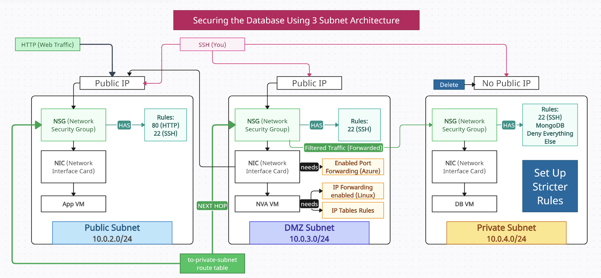

# 3 Subnet Architecture

### Re-attempt at 3 Subnet Architecture

Overview: I had a few issues with my previous attempt at the 3 Subnet Architecture as provided in the ascii table in Securing_Databases.md, so I'm trying again. This version has more detail.

### Steps to Replicate

#### 1. Creating the Security Groups

Once the virtual network was created, I created 3 security groups:

- **Public Subnet Security Group:** ``tech501-ameenah-3-subnet-version-public-subnet-nsg``
- **DMZ Subnet Security Group:** 
``tech501-ameenah-3-subnet-version-dmz-subnet-nsg``
- **Private Subnet Security Group:** 
``tech501-ameenah-3-subnet-version-private-subnet-nsg``

#### 2. Setting up the Virtual Network/Subnets
I made a virtual network with these details:

- **Name:** ``tech501-ameenah-3-subnet-vnet``
- **Location:** ``UK South``

Within this virtual network, I created 3 subnets:
- **Public Subnet:** ``10.0.2.0/24``
  - Assigned the public subnet security group to this subnet.
- **DMZ Subnet:** ``10.0.3.0/24``
  - Assigned the DMZ subnet security group to this subnet.
- **Private Subnet:** ``10.0.4.0/24``
  - Assigned the private subnet security group to this subnet.
  - Selected the **"Enable private subnet (no default outbound access)"** option.

#### 3. Setting up the Network Security Group Rules

I created the following Network Security Group rules for each of the security groups:

- **Public Subnet Security Group:**
  - Allow inbound HTTP and HTTPS traffic from the internet.
- **DMZ Subnet Security Group:**
  - Allow inbound traffic from the public subnet.
  - Allow outbound traffic to the private subnet.
- **Private Subnet Security Group:**
  - Allow inbound traffic from the DMZ subnet.

#### 4. Setting up the Virtual Machines

Created 3 virtual machines, as the database's private IP was needed to configure the public subnet VM's user data, this was created first.

- **Private Subnet VM:** 
  - **Name:** ``tech501-ameenah-in-3-subnet-sparta-db-vm-first``
  - **Subnet:** Placed in the private subnet.
  - **IP address:** Did not allocate a public IP address.
  - **Networking/NSG:** Assigned the private subnet security group to this VM.
  - **Image:** Created using an image that had the mongoDB installation on it.
  - **Security Type:** Standard
  - **User Data:** No user data required.
  - **Tags:** Owner: "Ameenah"

- **Public Subnet VM:** 
  - **Name:** ``tech501-ameenah-in-3-subnet-sparta-app-vm``
  - **Subnet:** Placed in the public subnet.
  - **IP address:** Allocated a new public IP address.
  - **Networking/NSG:** Assigned the public subnet security group to this VM.
  - **Image:** Created using an image that had the pre-installed sparta app on it.
  - **Security Type:** Standard
  - **User Data:** User data was used to link the database's private IP to the public subnet VM.
  - **Tags:** Owner: "Ameenah"

- **DMZ Subnet VM:** 
  - **Name:** ``tech501-ameenah-in-3-subnet-sparta-app-nva-vm``
  - **Subnet:** Placed in the DMZ subnet.
  - **IP address:** Allocated a new public IP address.
  - **Networking/NSG:** Assigned the DMZ subnet security group to this VM.
  - **Image:** Ubuntu 24.04 was used for this VM.
  - **Security Type:** Standard
  - **User Data:** No user data required.
  - **Tags:** Owner: "Ameenah"

#### 5. Setting up the Route Table

I created a new route table with the following configuration:

- **Name:** ``tech501-ameenah-to-private-subnet-rt``
- **Location:** ``UK South``

I added a route to the route table with the following configuration:

- **Address prefix:** ``0.0.0.0/0``
- **Next hop type:** ``Virtual appliance``
- **Next hop address:** ``10.0.3.4`` (The IP address of the DMZ subnet VM)

