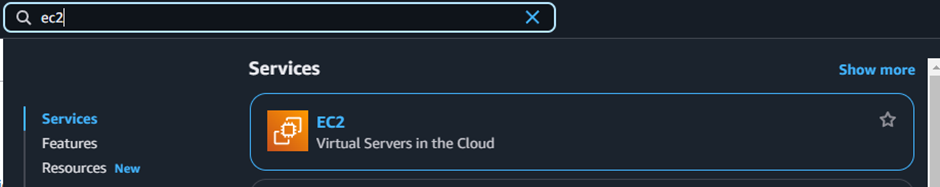
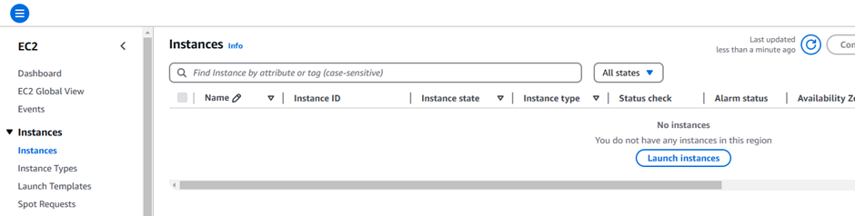
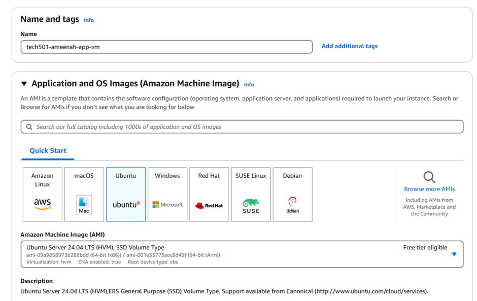

# Setting up and running the Sparta app on AWS EC2

Note to self: Log in from Ireland server.

1. Launch an EC2 Instance
   - Go to EC2 Dashboard
   - Click **"Launch Instance"**
  
   - Choose **Ubuntu 22.04 LTS**
   - Select **t3.micro**
   - Click "Next: Configure Instance Details"
   - Keep default settings and click "Next" until Security Groups

2. Configure Security Groups
   - Create a new security group
   - Add following rules:
     * SSH (Port 22) - Source: Your IP
     * HTTP (Port 80) - Source: Anywhere
     * ~~Custom TCP (Port 3000) - Source: Anywhere~~ There may be issues with this as I can't get port 3000 running. My first attempt didn't have this and my second attempt did. As I've seen some installations that don't require this that are working, I'm going to leave it out.
   - Click **"Review and Launch"**
   - Launch instance and create/download new key pair. I have saved my key pair as 'ameenah-aws-key.pem'

3. Connect to Your Instance
   - Open terminal/command prompt
   - Navigate to directory with your key pair (.pem file)
   - Run: chmod 400 your-key.pem as AWS instructs.
   - Connect using: ``ssh -i "C:\Users\intel\.ssh\ameenah-aws-key.pem" ubuntu@ec2-3-253-15-1.eu-west-1.compute.amazonaws.com``

4. Set Up Your Environment
   - Follow the typical instructions for the sparta app install.
   - Clone the repo of the Sparta app
   - Navigate to app directory
   - Run: ``npm install``
   - **Start your app:** npm start or node app.js

## Some Blockers

At the moment I am unable to get port 3000 running. I will attempt to debug on why this may be happening.

Potential causes:
- Firewall/Network settings
- Issues with the processes running(Unlikely, as I have reset the server and it is still not working)

Things I have tried:
- Resetting the server
- Adding and removing the port 3000 inbound rule
- Restarting the app
- Running the app with and without pm2
- Installing the reverse proxy to see if this helps.

Currently, none of these have helped yet. I will try remaking my VM from scratch and trying a variety of combinations to see what could be causing the issue.

## A Re-Attempt

I decided to return to recreate both the VM and the app, as I was unable to get the app running on the first attempt. 

Database:
Ubuntu Server 22.04 LTS
t3.micro
My previously created key pair for SSH access

SSH Enabled - 22/tcp

