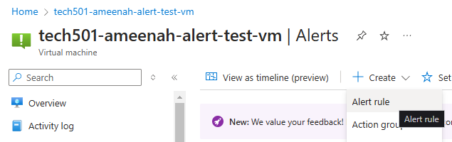
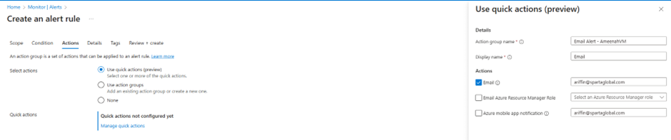
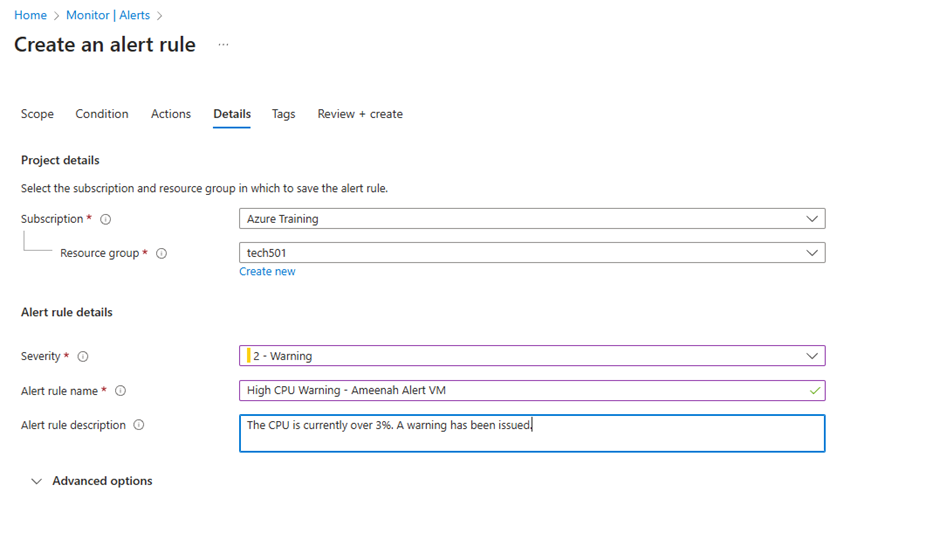
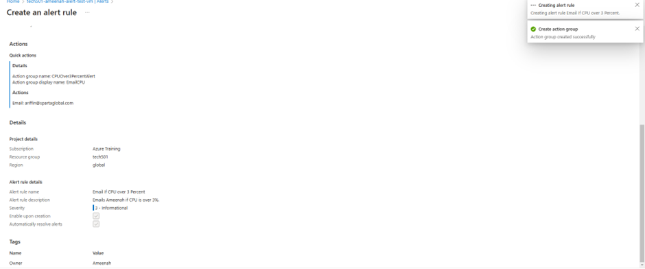
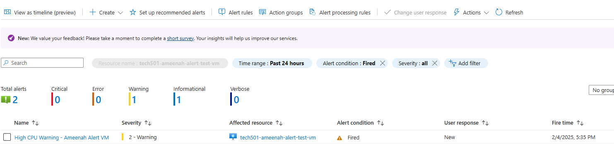
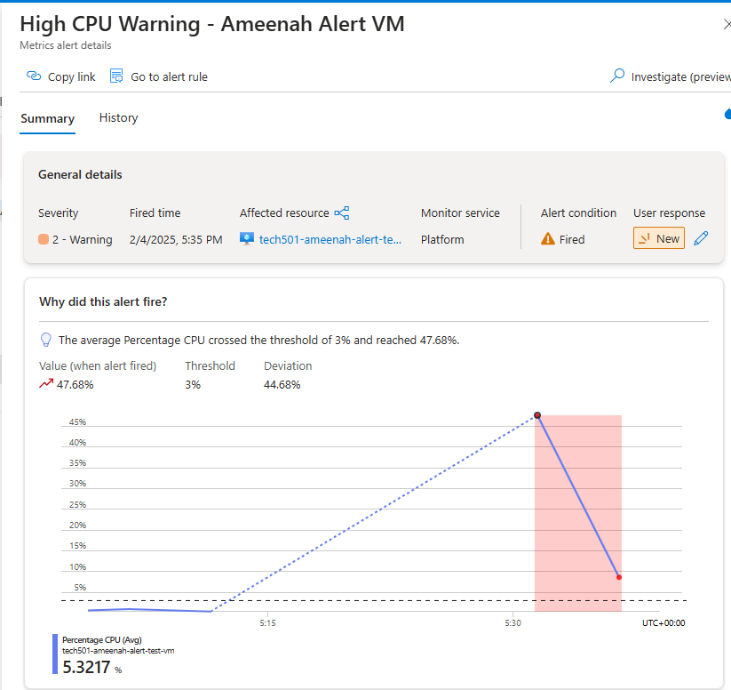

**Configure Azure Portal Alerts:**
   - Navigate to your VM in Azure Portal
   - Select "Monitoring" > "Alerts"
   - Click "New alert rule"
   - Set conditions for:
     - CPU Usage > 3% (Low, for testing only, in production this would be higher)
   - Severity: Warning
   - Action group: Email (Enter Name and Email)
   - Click "Create"

As I set the alert quite low, this triggered instantly upon running sudo apt-get update. In production we'd want to set this to a higher threshold for events where server load is higher due to traffic or internal processes.

