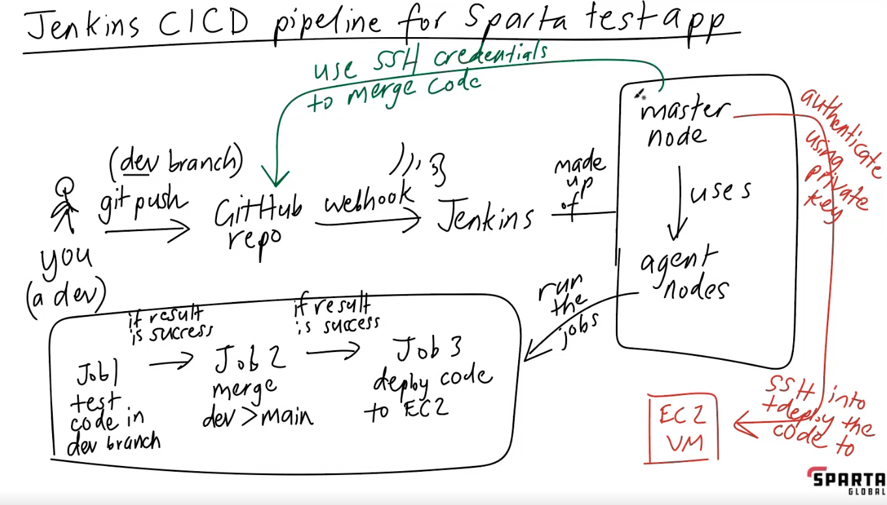

# Jenkins Pipeline

## Continuous Delivery vs Continuous Deployment

### Continuous Delivery 
- Code is ready and tested for deployment
- May involve deployment to test environments
- Requires approval process before production
- Delivers working artifacts ready to ship
- Code is always in a deployable state
- May have multiple environments (test, staging, etc)

### Continuous Deployment 
- Code is deployed straight to production
- No manual approval steps
- Changes reach end users within minutes
- Typically involves single environment (production)
- Faster delivery of features to users

## Jenkins Master Node

The Jenkins Master Node is the main control center of your Jenkins installation.
The master node is critical for Jenkins operations but typically doesn't run builds itself - it distributes them to agent nodes to maintain performance and scalability.

## Jenkins Agent Node

The Jenkins Agent Node is the computer that runs the Jenkins agent. The agent node runs the Jenkins plugins and executes the build steps defined in the Jenkinsfile.

