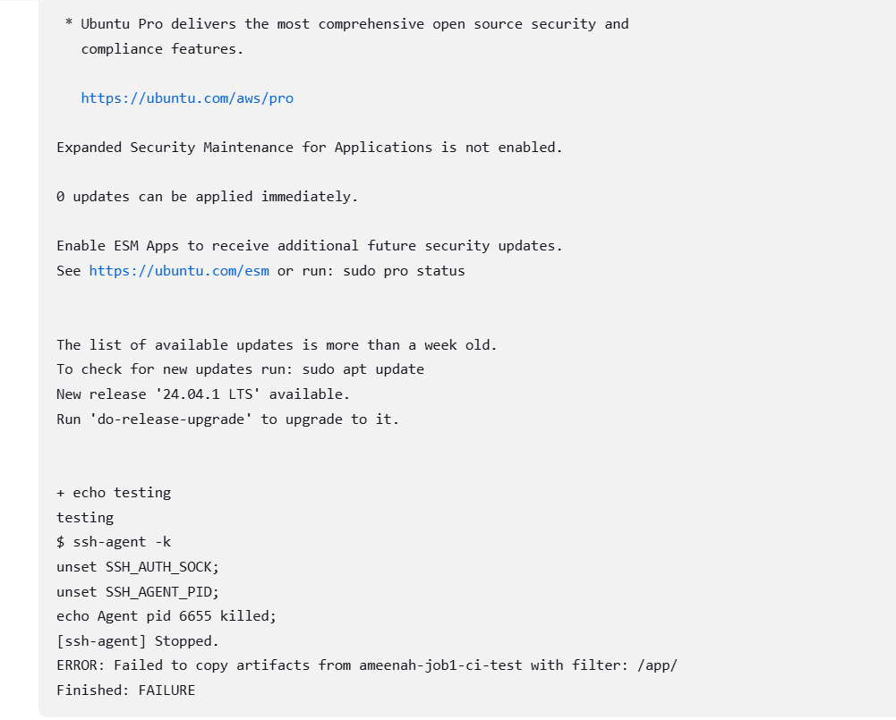

**Objectives:**

Location of file to edit:
sudo nano "app/views/index.ejs"

This should be updated via git, and trigger the pipeline to be updated onto our VM via Jenkins as a form of continuous deployment.
 
# Making Changes with Jenkins

This is a step-by-step guide on how I am making changes to my application using Jenkins, first we'll need an AWS instance running.

## Setting up the AWS Environment
   I made an AWS instance and installed ubuntu onto it. 

   - Name: `tech501-ameenah-jenkins-app-server-vm`
   - OS: `Ubuntu Server 22.04 LTS (HVM), SSD Volume Type`
   - Virtual server type (instance type): `t3.micro`
   - Key Pair: `ameenah-aws-key`
   - Network: `vpc-07e47e9d90d2076da` | `Default-vpc`
   - Allow SSH traffic from: Anywhere
   - Allow HTTP traffic

Once my VM was set up, I followed the instructions to install Jenkins on my VM.


________

# Jenkins Job 3 Deployment Documentation

## Overview
This document provides a summary of the setup and configuration for the Jenkins Job 3 deployment, as well as the challenges encountered during the process.

## Setup Steps
1. **Job Configuration**
   - Created `ameenah-job3-ci-deploy` in Jenkins as part of a 3-job CI/CD pipeline.
   - Linked the GitHub repository containing the application code.
     - Repository URL: https://github.com/AmeenahRiffin/tech501-sparta-app-cid
   - Configured the job to be triggered by the successful completion of Job 2.
   - Utilized credentials for GitHub and AWS EC2 SSH connections.

2. **Build Environment**
   - Configured the build environment to use SSH keys for secure connections.
     - GitHub Credentials: `github-2-jenkins`
     - AWS EC2 Credentials: `ameenah-aws-key`

3. **Build Steps**
   - Added a shell command to SSH into the AWS EC2 instance - to see if my connection was successful:
     ```bash
     ssh -o StrictHostKeyChecking=no ubuntu@ec2-52-209-25-135.eu-west-1.compute.amazonaws.com
     echo "Testing"
     ```
   - Attempted to copy files from Jenkins to AWS EC2 using SCP:
     ```bash
     scp -r ./* ubuntu@ec2-52-209-25-135.eu-west-1.compute.amazonaws.com:/var/www/app
     ```

## Challenges Encountered
1. **File Transfer Errors**
   - Jenkins was unable to transfer the tested code from Job 1 to Job 3, resulting in a failed deployment.
   - I have checked both Job 1 and Job 3 to ensure artifact files can be transferred as the project specifications state that we cannot clone  directly from GitHub.
  

## Next Steps
- Investigate why the file transfer from Job 1 to Job 3 is failing.
- SCP to transfer the tested files from Jenkins to AWS EC2.

## Conclusion
I intend to continue troubleshooting the file transfer issue and resolve it in the next steps.

