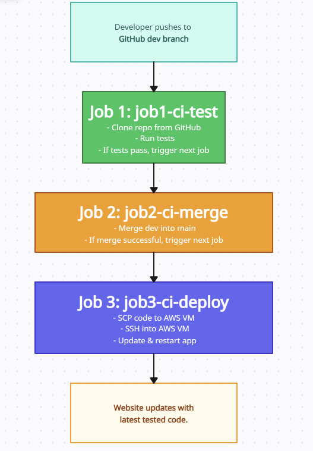

**Objectives:**

Location of file to edit:
"app/views/index.ejs"



This should be updated via git, and trigger the pipeline to be updated onto our VM via Jenkins as a form of continuous deployment.
 
# Making Changes with Jenkins

This is a step-by-step guide on how I am making changes to my application using Jenkins, first we'll need an AWS instance running.

## Setting up the AWS Environment
   I made an AWS instance and installed ubuntu onto it. 

   - Name: `tech501-ameenah-jenkins-app-server-vm`
   - OS: `Ubuntu Server 22.04 LTS (HVM), SSD Volume Type`
   - Virtual server type (instance type): `t3.micro`
   - Key Pair: `ameenah-aws-key`
   - Network: `vpc-07e47e9d90d2076da` | `Default-vpc`
   - Allow SSH traffic from: Anywhere
   - Allow HTTP traffic

Once my VM was set up, I followed the instructions to install Jenkins on my VM.


________

# Jenkins Job 3 Deployment Documentation

## Overview
This document provides a summary of the setup and configuration for the Jenkins Job 3 deployment, as well as the challenges encountered during the process.

## Setup Steps
1. **Job Configuration**
   - Created `ameenah-job3-ci-deploy` in Jenkins as part of a 3-job CI/CD pipeline.
   - Linked the GitHub repository containing the application code.
     - Repository URL: https://github.com/AmeenahRiffin/tech501-sparta-app-cid
   - Configured the job to be triggered by the successful completion of Job 2.
   - Utilized credentials for GitHub and AWS EC2 SSH connections.

2. **Build Environment**
   - Configured the build environment to use SSH keys for secure connections.
     - GitHub Credentials: `github-2-jenkins`
     - AWS EC2 Credentials: `ameenah-aws-key`

3. **Build Steps**
   - Added a shell command to SSH into the AWS EC2 instance - to see if my connection was successful:
     ```bash
     ssh -o StrictHostKeyChecking=no ubuntu@ec2-52-209-25-135.eu-west-1.compute.amazonaws.com
     echo "Testing"
     ```
   - Attempted to copy files from Jenkins to AWS EC2 using SCP:
     ```bash
     scp -r ./* ubuntu@ec2-52-209-25-135.eu-west-1.compute.amazonaws.com:/var/www/app
     ```

## Challenges Encountered
1. **File Transfer Errors**
   - Jenkins was unable to transfer the tested code from Job 1 to Job 3, resulting in a failed deployment.
   - I have checked both Job 1 and Job 3 to ensure artifact files can be transferred as the project specifications state that we cannot clone  directly from GitHub.
  

## Next Steps
- Investigate why the file transfer from Job 1 to Job 3 is failing.
- SCP to transfer the tested files from Jenkins to AWS EC2.

## Conclusion
I intend to continue troubleshooting the file transfer issue and resolve it in the next steps.

___________


DB Set up:

Set VM instance to DB:
export DB_HOST=mongodb://172.31.49.236:27017/posts

Based on the image you uploaded, here’s an additional section describing the changes you made and how they fixed the issue:  

---

## Changes Made and Issue Resolution  

After troubleshooting the SCP file transfer issue, I made the following key changes to my Jenkins Job 3 (`ameenah-job3-ci-deploy`):  

1. **Updated SCP Command**  
   - Previously, Jenkins was failing to transfer the tested code from Job 1 to the AWS EC2 instance.  
   - I modified the SCP command to correctly reference the workspace directory of `ameenah-job1-ci-test`, ensuring the correct files are copied over.  
   - The updated command now explicitly pulls from Jenkins' workspace:  

     ```bash
     scp -o StrictHostKeyChecking=no -r /var/jenkins/workspace/ameenah-job1-ci-test/app/ ubuntu@<EC2_PUBLIC_IP>:~/
     ```  

2. **Adjusted SSH Commands for Deployment**  
   - After transferring the files, I updated the SSH command to properly execute on the remote EC2 instance.  
   - It now:  
     - Installs missing dependencies (`sudo apt install -y nginx`).  
     - Sets the database environment variable (`export DB_HOST=mongodb://<PRIVATE_DB_IP>:27017/posts`).  
     - Stops and restarts the app (`pm2 stop app && pm2 start app.js`).  
   - This ensures that after each deployment, the latest code is executed correctly.  

3. **Why This Worked**  
   - The previous issue was due to incorrect file transfer paths, causing Job 3 to not receive the latest tested code.  
   - Fixing the SCP command ensured that Jenkins correctly copies files from Job 1 to Job 3.  
   - Ensuring SSH commands execute correctly on the EC2 instance allowed for a smooth deployment, successfully updating the app.  

With these changes, my pipeline now follows a **fully automated CI/CD process**, where changes to the GitHub repo trigger updates that are successfully deployed to my AWS instance.

