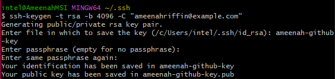

# Github Key Setup

- [Github Key Setup](#github-key-setup)
    - [Setup SSH Key for Github](#setup-ssh-key-for-github)
    - [Create a Repo on Github](#create-a-repo-on-github)
    - [Initialize Git Repo](#initialize-git-repo)

### Setup SSH Key for Github

1. Create a ssh key for github by navigating to the `~/.ssh` directory by typing `cd ~/.ssh`. I've named mine "ameenah_github_key" and created it with the following command: `ssh-keygen -t rsa -b 4096 -f ameenah_github_key -P ""`

   

2. Add the public key to github: https://github.com/settings/keys - you can get the contents of the key by running `cat ameenah_github_key.pub`

   
   
   

3. Run `eval 'ssh-agent -s'"` to start ssh-agent

   

4. Run `ssh-add ameenah_github_key` to add the key to the ssh-agent

5. Run `ssh -T git@github.com` to test the connection.

   

### Create a Repo on Github

6. cd to the GitHub folder you typically store your projects in.

   

7. Create a repo on github for "tech501-test-ssh".

   

8. Create a Folder for "tech501-test-ssh" and navigate to it.

   

### Initialize Git Repo

9. Initialize git in the folder with `git init`

10. Create a readme.md file `echo "# tech501-test-ssh" > README.md`

11. Test the file's contents with `cat README.md`.

12. Rename the main branch to "main" `git branch -M main`

13. Set origin to github `git remote add origin git@github.com:AmeenahRiffin/tech501-test-ssh.git`

14. Add the file to git `git add README.md` or `git add .` for all files.

15. Commit the file `git commit -m "first commit"`

16. Push the file to github `git push origin master`

17. Commit the file to github `git commit -m "added readme with one line"`

   

18. Git push the file to github `git push --set-upstream origin main`

19. The changes should now appear on the Git repo.

   
