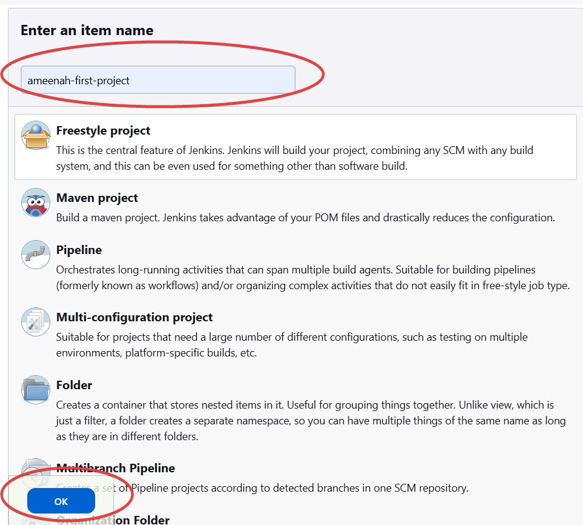
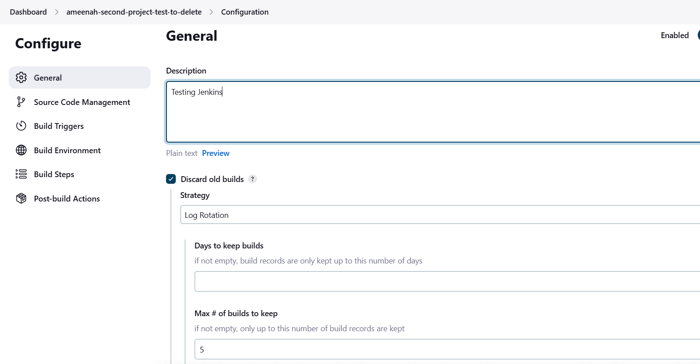
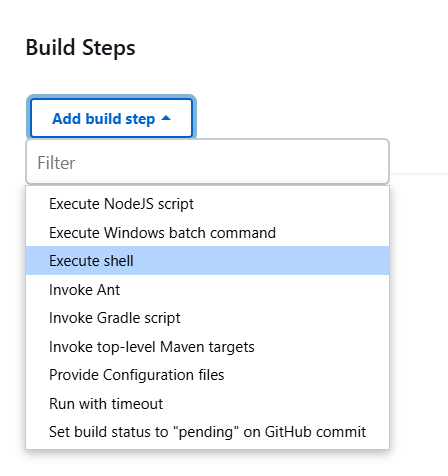
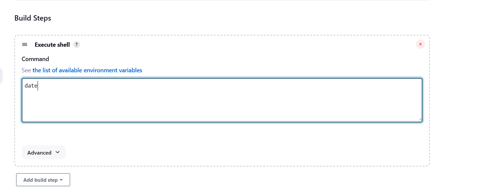

# Making and Running Builds in Jenkins

- [Making and Running Builds in Jenkins](#making-and-running-builds-in-jenkins)
  - [Making a new Build](#making-a-new-build)
  - [Linking Jobs Together](#linking-jobs-together)

## Making a new Build

1. Log into your Jenkins dashboard.
2. Click "New Item"
3. Enter a name for your project and select "Freestyle project"
    
4. Click "OK"
5. Add a description if you want, and select "Discard old builds" if we intend to discard old builds.
   
6. Scroll down and locate Build Steps > "Execute Shell"
   
7. We'll enter a sample script in shell to test the build. In this case, we're simply printing the date. Only `date` is needed.
   
8. Click "Save"
9.  Click "Build Now"

## Linking Jobs Together

1. Select the build
2. "Post Build Actions" > "Build other projects"
3. Enter the name(s) the job(s) you want to link to
4. When you run this job, the linked jobs will run after it.