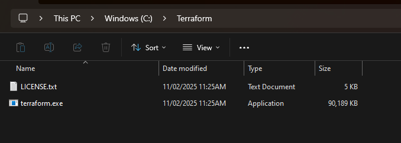
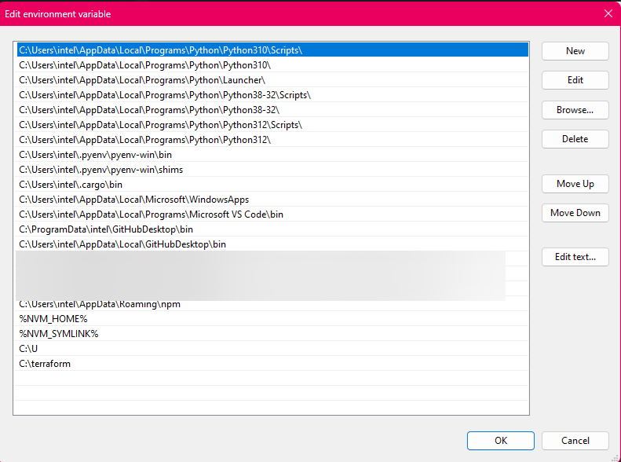
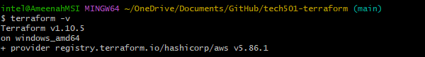

# How to Install Terraform on Windows

I use the windows OS, so this guide is specific to that.

1. **Download Terraform**:
   - Downloaded Terraform from: https://developer.hashicorp.com/terraform/install

2. **Adding Files to System**:
   - Extract the files from the zip folder and add them to `C:\Terraform` or `C:\Hashicorp\Terraform`
    

3. **Add Terraform to System PATH**:
   - Open the Start menu, search for "Environment Variables," and select "Edit the system environment variables."
   - In the System Properties window, click the "Environment Variables..." button.
   - In the Environment Variables window, find the "Path" variable in the "System variables" section and click "Edit...".
   - Click "New" and enter the path to the folder where you extracted Terraform (e.g., `C:\Terraform`).
   - Click "OK" to close all windows, this is persistent and should save there permanently.
    

4. **Verify Installation**:
   - Open Command Prompt by typing `cmd` in the Start menu and pressing Enter.
   - Type `terraform -v` and press Enter to verify Terraform is installed. You should see the installed version number.
    

**Note**: Ensure you have the necessary permissions to modify system environment variables.

## Adding System Variables

Instead of an SSH key, I added the `AWS_ACCESS_KEY_ID` and `AWS_SECRET_ACCESS_KEY` to the system variables. These are private and cannot be shared, these were added to the system environment variables and tested using `echo $AWS_ACCESS_KEY_ID` and `echo $AWS_SECRET_ACCESS_KEY` in bash. It also works in CMD by using '%' on both sides of the variable instead of '$'.
