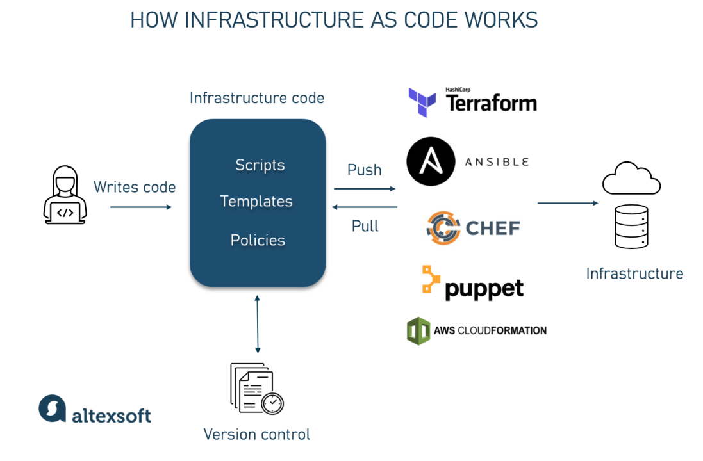

# What is pull and push configuration management (IaC)?

**Pull** is a method of configuration management where the agent (subject being configured) pulls the configuration from the server. The agent is responsible for asking the server for the configuration and deploying it. The server does not know when the agent needs to update it's configuration. The agent is in control of when it's configuration is updated.

**Push** is a method of configuration management where the server pushes the configuration to the agent. The agent does not know when the server wants to update it's configuration. The server is in control of when it's configuration is updated.

## Which tools support push/pull?

Some tools that support push configuration management are:
- Ansible
- Terraform
- Salt
- AWS OpsWorks
- Fabric
- Capistrano

Some tools that support pull configuration management are:
- Chef
- Puppet
- Salt
- CFEngine

## Does Terraform use the push or pull configuration?

Terraform uses a push configuration. Terraform is a command line tool that builds, changes, and manages infrastructure. Terraform uses a declarative configuration file to build and manage infrastructure.

## Which is better: push or pull configuration management?

Push configuration management is better suited for small to medium sized networks. It is easier to manage and less complex. However, it does not scale well for large networks. It also requires the server to know the configuration of all the agents.

Pull configuration management is better suited for large networks. It is more complex, but it scales better. It also requires less knowledge of the agents on the server.

