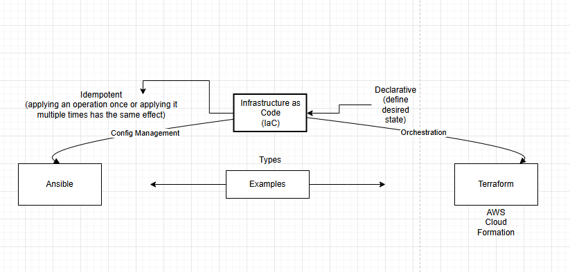
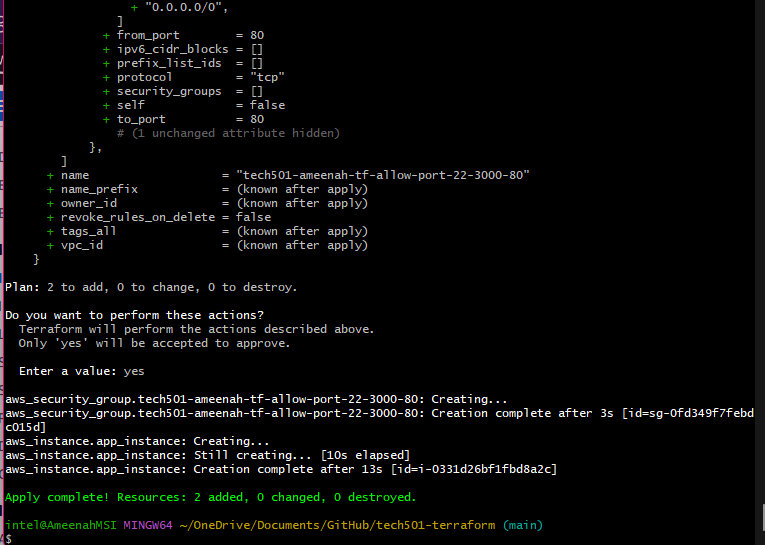
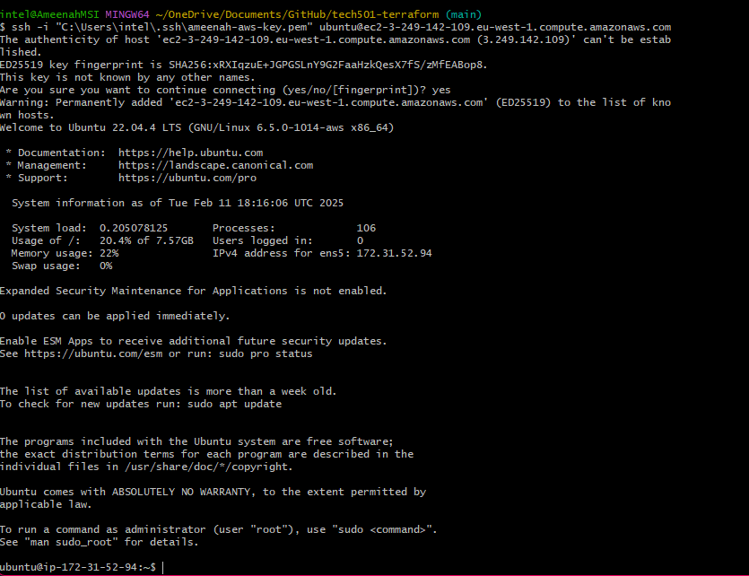
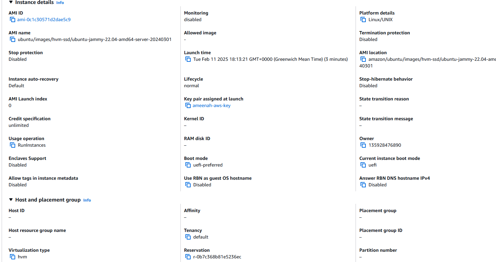
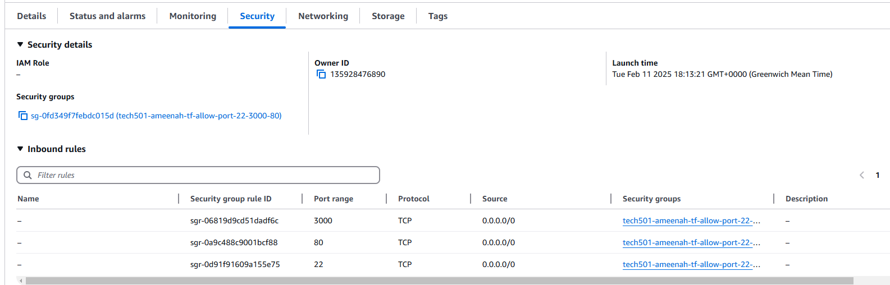
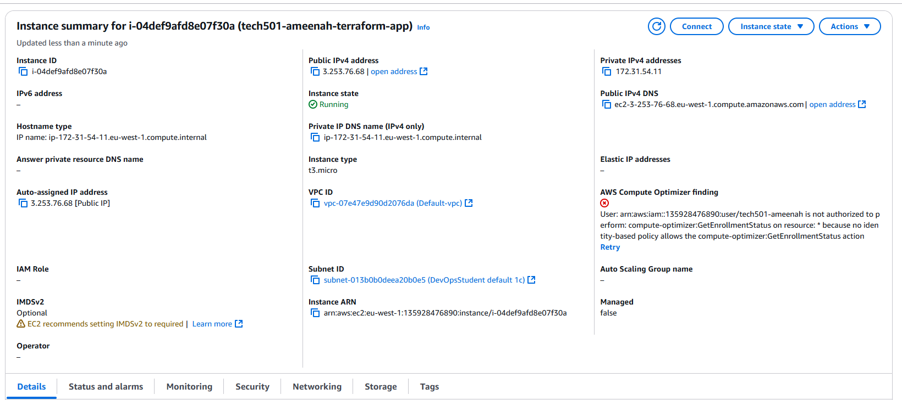
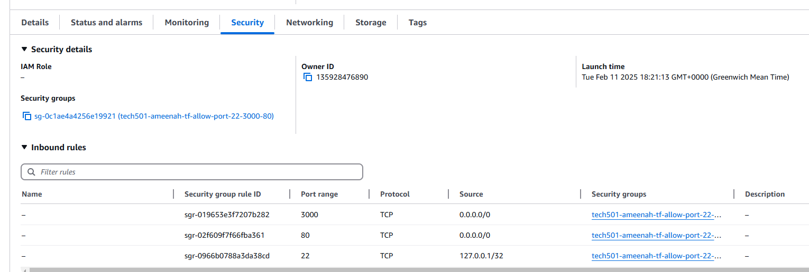
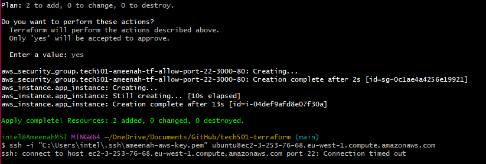

# Using Terraform to add an AWS security group

## Task


## Step by Step Guide on how to use Terraform to create an EC2 instance on AWS

### Step 1: Create the EC2 instance / Security Group
- I created an EC2 instance and specified the region, AMI ID, instance type, and that I wanted a public IP address.

- I created a security group and specified the name, description, and the rules for the security group.

- I attached the key to the EC2 instance so that I can use it to log in.

- I specified the security group in the EC2 instance so that it will use the security group to allow the specified ports.

```
# where to create it - provide cloud name
provider "aws" {
# what region to use (where to create these resources)
    region = "eu-west-1" # we're setting this to ireland
}
# which service to create/resources
resource "aws_instance" "app_instance" {
# which AMI ID
    ami = "ami-0c1c30571d2dae5c9"

# which type of instance
    instance_type = "t3.micro"

# that we want a public ip
    associate_public_ip_address = true

# name the service/instance
    tags = {
        Name = "tech501-ameenah-terraform-app"
    }

# use the security group
    vpc_security_group_ids = [aws_security_group.tech501-ameenah-tf-allow-port-22-3000-80.id]

# which key to use
    key_name = "ameenah-aws-key"
}

## Adds the security group as per the requirements i'm naming this appropriately,
resource "aws_security_group" "tech501-ameenah-tf-allow-port-22-3000-80" {
    name = "tech501-ameenah-tf-allow-port-22-3000-80"
    description = "Security group allowing ports 22, 3000, and 80"

# allow port 22 from localhost
    ingress {
        from_port = 22
        to_port = 22
        protocol = "tcp"
        cidr_blocks = ["127.0.0.1/32"] # This is localhost, but it will only work on the machine that is running Terraform. 
        # It works for logging into the AWS if I use 0.0.0.0/0 instead, as I have tested.
    }

# port 3000 rule
    ingress {
        from_port = 3000
        to_port = 3000
        protocol = "tcp"
        cidr_blocks = ["0.0.0.0/0"]
    }

# allow port 80 from all
    ingress {
        from_port = 80
        to_port = 80
        protocol = "tcp"
        cidr_blocks = ["0.0.0.0/0"]
    }
}
```

This successfully worked with planning and applying in Terraform.

### Step 2: Test the infrastructure
I knew that setting port 22 to localhost would not work as per project specifications because I am not on the AWS machine directly, and this would not allow me to log in with SSH. So initially I had port 22's cidr block set to 0.0.0.0/0 which allowed me to log in successfully. Once I created that version and tested it in SSH, I destroyed it.








## Localhost SSH (Current State vs. Desired State)

For project specifications I remade the VM once more, but then I changed the port 22 cidr block to 127.0.0.1/32 (localhost) for the project specifications.

It would not let me log in, as expected, but it did deploy. My desired state would have been to be able to log in with SSH, as per my first deploy.









## Conclusions

This was a fun experiment with Terraform and AWS, I found it much easier to do than manually making a VM and would like to do more test runs in future along with possibly doing something with a higher level of automation/scope.