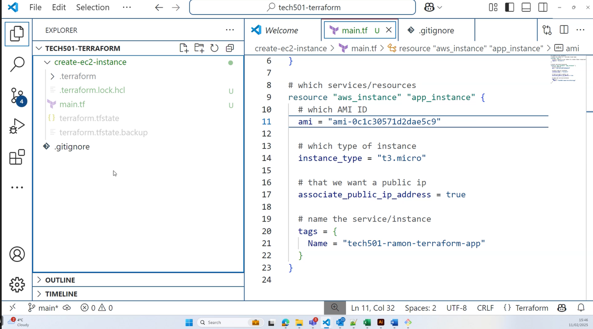
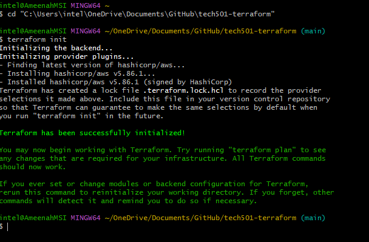
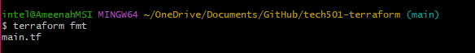
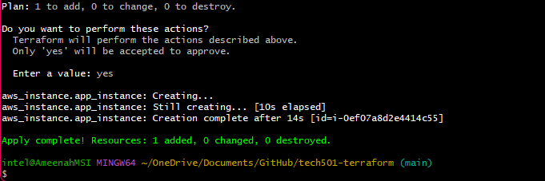
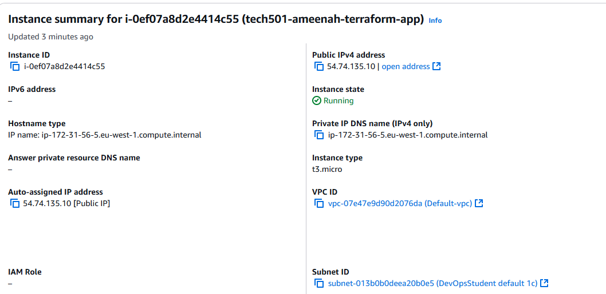
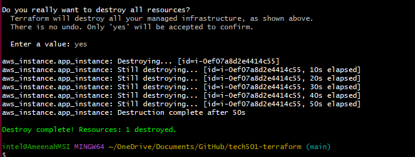

# Terraform commands
## Non-destructive commands
* `terraform init` - prepare local working directory for working with your
  infrastructure's configuration. This command will download the necessary
  plugins for the providers you specified in your configuration files.
* `terraform plan` - create an execution plan, which lets you review the changes
  that will be made when you run `terraform apply`. This command won't actually
  make any changes. You can save the plan to a file by  using the `-out` flag,
  IE: `terraform plan -out=plan.out` (this will save the plan to a file).
* `terraform console` - an interactive console for evaluating expressions.
## Destructive commands
* `terraform apply` - apply the changes described in your `.tf` files. This
  command will provision your infrastructure according to your configuration.
* `terraform destroy` - destroy all resources managed by the current working
  directory.

  

Before proceeding, I installed Terraform and ensured my AWS credentials were set in my windows environment.


## Step 1: Create a new git
I created a new git called `tech501-terraform` to store my terraform configuration files on github.

## Step 2: Initialize Terraform
I ran `terraform init` in the `tech501-terraform` directory to prepare my local working directory for working with my infrastructure's configuration.


`terraform fmt` is a tool that formats your terraform files.



## Step 3: Set .gitignore
I created a `.gitignore` file in the `.terrform` directory (including subfiles) and `.terraform.lock.hcl` to ensure I don't accidentally commit sensitive data:

# Step 4: Create a main.tf file
I created a `main.tf` file in the main directory to define my infrastructure's configuration.

### My `main.tf` file:
```
    # create an ec2 instance
    # where to create it - provide cloud name
    provider "aws" {
    # what region to use (where to create these resources)
    region = "eu-west-1"
    # we're setting this to ireland
    }

    # which service to create/resources
    resource "aws_instance" "app_instance" {
    # which AMI ID
    ami = "ami-0c1c30571d2dae5c9"
    # which type of instance
    instance_type = "t3.micro"
    # that we want a public ip
    associate_public_ip_address = true
    # name the service/instance
    tags = {
        Name = "tech501-ameenah-terraform-app"
    }
    }
```

### Step 5: Terraform Plan and Apply

* I used `terraform plan` to create an execution plan based on the `main.tf` file we made, which allowed me to see what changes Terraform will make to my infrastructure without actually applying them. This step helped me ensure that the planned changes were correct.
  
* `terraform apply` ensured that all the resources were created and configured as specified, providing me with the desired infrastructure setup. You have to type "yes" to confirm apply the changes.



### Step 6: Checking my instance on AWS

I checked AWS to see if my instance had deployed, it went smoothly with no blockers.




## Step 7: Destroying my instance

I used `terraform destroy` to delete my instance. It deleted it successfully from AWS.


