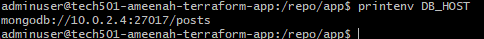

# Two-Tier Architecture Implementation in Azure using Terraform

## Overview
I created a two-subnet architecture for the Sparta app and database deployment in Azure using Terraform. This implementation required separate subnets for the application and database tiers.

## Achievements
- Created a complete networking setup with VNet and two subnets
- Successfully deployed the Sparta app VM
- Successfully deployed the MongoDB database VM
- Established security groups and rules
- Configured network interfaces correctly

## Blockers Resolved
1. **Image Compatibility Issue**
   - Initially attempted to use Ubuntu 22.04 image
   - Image was causing deployment issues
   - Resolved by switching to pre-configured Sparta app image
   
2. **Terraform Syntax Differences**
   - Had to adapt AWS terraform knowledge to Azure
   - Key differences found in:
     - Resource naming conventions
     - Network security group rules

### Investigation:
1. **Database Connection**
   - Database and app VMs can ping each other successfully
   - DB_HOST environment variable is correctly set
   - MongoDB bind IP is configured properly (Have checked on DB side)
   - Have tried restarting the mongodb service on db and checked if it is running

## Next Steps
- Debug database connection issues
- Verify all security group rules are properly configured