## Progress Report on Jenkins Server Setup

So far, I have:
- Create the new GitHub repository "CICD-with-own-Jenkins-project"
- Set up an Ubuntu 22.04 LTS server
- Installed Java 17 on the server
- Added the Jenkins repository and its key
- Installed Jenkins
- Started and enabled the Jenkins service
- Configured Jenkins through the web interface
- Set up the required environments:
   - Node JS 20 for the Sparta test app
   - Java 17 and MySQL for the World API


**What I still need to do:**
1. Build the Jenkins pipeline for app deployment

2. Create documentation including:
   - Setup instructions
   - Jenkins pipeline diagram
   - General process diagram
 - 
3. Record the 5-7 minute demonstration video showing:
   - Jenkins build process
   - Environment setup
   - Pipeline rebuild steps


# Setting up my own Jenkins server

- [Setting up my own Jenkins server](#setting-up-my-own-jenkins-server)
  - [Setting up Jenkins (On Windows)](#setting-up-jenkins-on-windows)
  - [Setting up Jenkins (On Ubuntu)](#setting-up-jenkins-on-ubuntu)
  - [Making a Jenkins Pipeline](#making-a-jenkins-pipeline)
    - [Job 1 Results](#job-1-results)
    - [Job 2 Results](#job-2-results)
    - [Job 3 Results (With Blockers)](#job-3-results-with-blockers)
      - [Job 3 Resolution Update](#job-3-resolution-update)
  - [Final Result](#final-result)


## Setting up Jenkins (On Windows)

I decided to set up Jenkins on my Windows machine first to become familiar with Jenkins. In order to do this, I had to install Java by downloading Java 17 through a file called `jdk-17.0.12_windows-x64_bin.zip` from the Oracle website.

I then installed the Jenkins executeable from the Jenkins website and used that downloaded Java as part of the installation. Jenkins only appears to accept Java 17 and 21. 

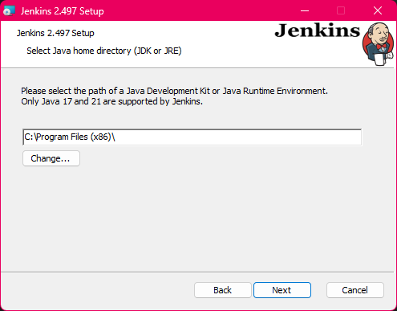


Once Jenkins was installed, I had to enable it by going to cmd.exe and typing in the following command: `.\jenkins.exe start`

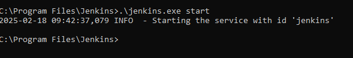


Once this was done, I started Jenkins and ran through the installation steps. 

I navigated to the URL on port 8080 and was greeted with the main dashboard. As part of the instructions I was informed to not set up an agent node so I left it on the default in-built node.

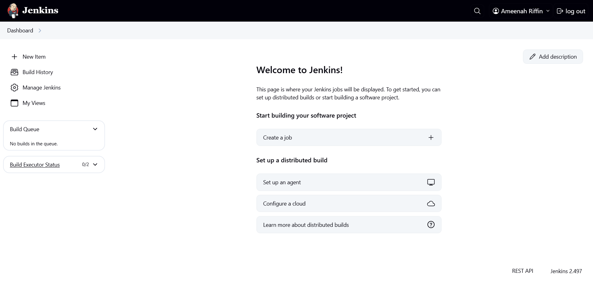


## Setting up Jenkins (On Ubuntu)


First, I needed to add the Jenkins repository key to ensure secure package downloads:

```
curl -fsSL https://pkg.jenkins.io/debian-stable/jenkins.io-2023.key | sudo tee \
    /usr/share/keyrings/jenkins-keyring.asc > /dev/null

```
Then I added the Jenkins repository to my system's sources:

```
echo deb [signed-by=/usr/share/keyrings/jenkins-keyring.asc] \
    https://pkg.jenkins.io/debian-stable binary/ | sudo tee \
    /etc/apt/sources.list.d/jenkins.list > /dev/null

```
I updated my package list to include the new repository:

```
sudo apt update
```

Finally, I installed Jenkins:

```
sudo apt install jenkins

```
After installation, I started the Jenkins service and enabled it to start on boot:

```
sudo systemctl start jenkins
sudo systemctl enable jenkins
```

To verify Jenkins was running correctly, I checked its status:

```
sudo systemctl status jenkins

```
I then accessed Jenkins through my web browser by navigating to http://localhost:8080. To get the initial admin password, I had to run:

```
sudo cat /var/lib/jenkins/secrets/initialAdminPassword

```
I copied this password and used it to unlock Jenkins in my browser. After this, I proceeded with the installation wizard, installing the suggested plugins and creating my admin user account. Again, I did not set up an agent node.

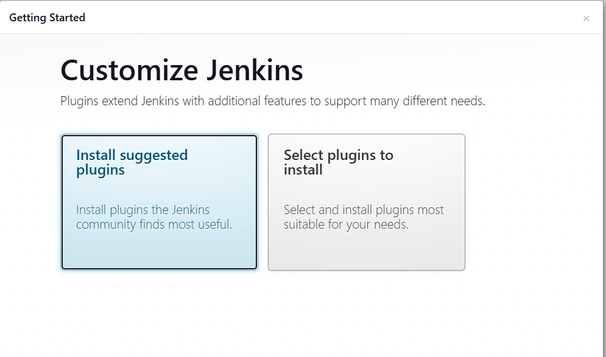

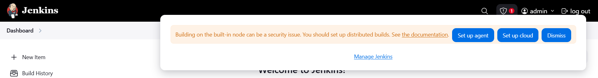


## Making a Jenkins Pipeline

Using my AWS instance, I set up a Jenkins pipeline called "ameenah-job1-ci-test" as part of my CI/CD pipeline. 

I followed the same steps as I did in the previous job, there were some new things I had to keep a track of. Namely:

- Installing the SSH Agent, Github, and NodeJS Jenkins plugins.
- Updating my github webhook to include the Jenkins URL.
- Allowing SSH method connections for Jenkins.

I readded my SSH keys and proceeded to create my pipeline.


### Job 1 Results

1. Configure Basic Settings
   - Name it **"ameenah-job1-ci-test"** 
   - Add description: **"Testing phase for pipeline, triggered by dev branch edits"**
   - Enable **"Discard old builds"** with max 5 builds

2. Set Up GitHub Integration  
   - Check **"GitHub project" **
   - Enter repo URL: `https://github.com/AmeenahRiffin/tech501-sparta-app-cid/`

3. Configure Source Code Management
   - Select Git
   - Repository URL: `git@github.com:AmeenahRiffin/tech501-sparta-app-cid.git`
   - Add credentials: `ameenah-jenkins-2-github`
   - Branch specifier: `/dev`

4. Set Up Build Trigger
   - Enable **"GitHub hook trigger for GITScm polling"**

5. Add Build Step
   - Add shell script:
```     
     echo TEST
     cd app
     npm install
     npm test
     pwd
```  


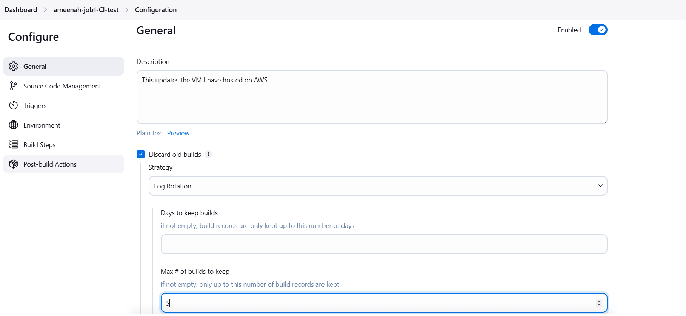

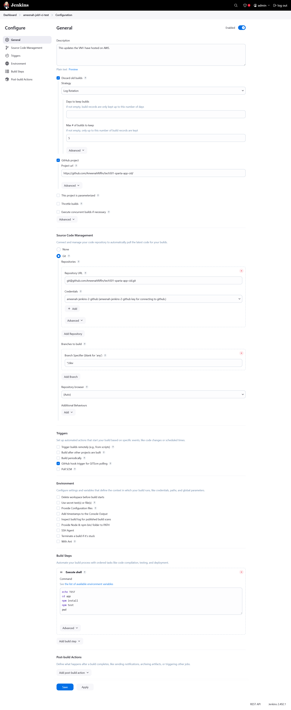

### Job 2 Results


1. **Configure Basic Settings**
   - Name it **"ameenah-job2-ci-merge"** 
   - Add description: **"Second phase of CI pipeline, merges dev into main after tests pass in Job 1."**  
   - Enable **"Discard old builds"** with max **5** builds  

2. **Set Up GitHub Integration**  
   - Check **"GitHub project"**  
   - Enter repo URL: `https://github.com/AmeenahRiffin/tech501-sparta-app-cid/`  
  
3. **Configure Source Code Management**  
   - Select **Git**  
   - Repository URL: `git@github.com:AmeenahRiffin/tech501-sparta-app-cid.git`  
   - Add credentials: **`ameenah-jenkins-2-github`**  
   - Branch specifier: **`/dev`**  

4. **Set Up Build Trigger**  
   - Enable **"Build after other projects are built"**  
   - Add **"ameenah-job1-ci-test"** as the upstream job  
   - Enable **"GitHub hook trigger for GITScm polling"**  

5. **Set Up SSH Authentication**  
   - Enable **"SSH Agent"**  
   - Use credentials: **`ameenah_github_key`**  

6. **Add Build Step**  
   - Add shell script:  
   ```sh
   # Switch to dev to get the latest changes
   git checkout dev
   git pull origin dev

   # Switch to main and update it with changes from dev
   git checkout main
   git merge dev
   git push origin main
   ```

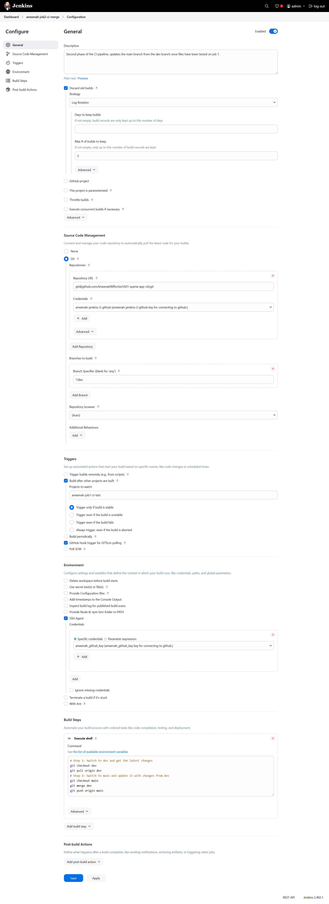


### Job 3 Results (With Blockers)

Job 3 is not yet fully configured. It runs successfully and SCPs the files to the AWS instance, but I have not yet configured the AWS instance to re-run the application yet.

Mild blocker as the app refuses to terminate its process (it respawns after being killed) which stops me from restarting the app. I do not know how to configure the AWS instance to run the app in order to re-run itself during the third pipeline step, will revolve this later.

#### Job 3 Resolution Update

I have managed to finish off and resolve the issue with the app refusing to terminate its process, it just needed a restart. The app successfully stops and starts with pm2 now, after reinstalling pm2.

1. **Configure Basic Settings**
   - Name it **"ameenah-job3-ci-deploy"**
   - Add description: **"Third phase of CI pipeline, deploys app to AWS instance after merge."**
   - Enable **"Discard old builds"** with max **5** builds

2. **Set Up GitHub Integration**
   - Check **"GitHub project"**
   - Enter repo URL: `https://github.com/AmeenahRiffin/tech501-sparta-app-cid/`

3. **Configure Source Code Management**
   - Select **None** (We're getting the tested files from Job 1.)

4. **Set Up Build Trigger**
   - Enable **"Build after other projects are built"**
   - Add **"ameenah-job2-ci-merge"** as the upstream job

5. **Set Up SSH Authentication**
   - Enable **"SSH Agent"**
   - Use credentials: **`ameenah_aws_key`**, **`ameenah_github_key`**, and **`ameenah_jenkins-2-github`**

6. **Add Build Step**
   - Add shell script:
 ```  
scp -o StrictHostKeyChecking=no -r /var/lib/jenkins/workspace/ameenah-job1-ci-test/app ubuntu@ec2-52-31-12-16.eu-west-1.compute.amazonaws.com:~/

ssh -o StrictHostKeyChecking=no ubuntu@ec2-52-31-12-16.eu-west-1.compute.amazonaws.com "cd app && pm2 stop app && pm2 start app"
``` 

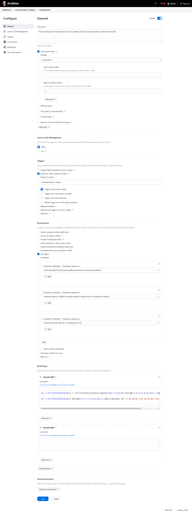

## Final Result
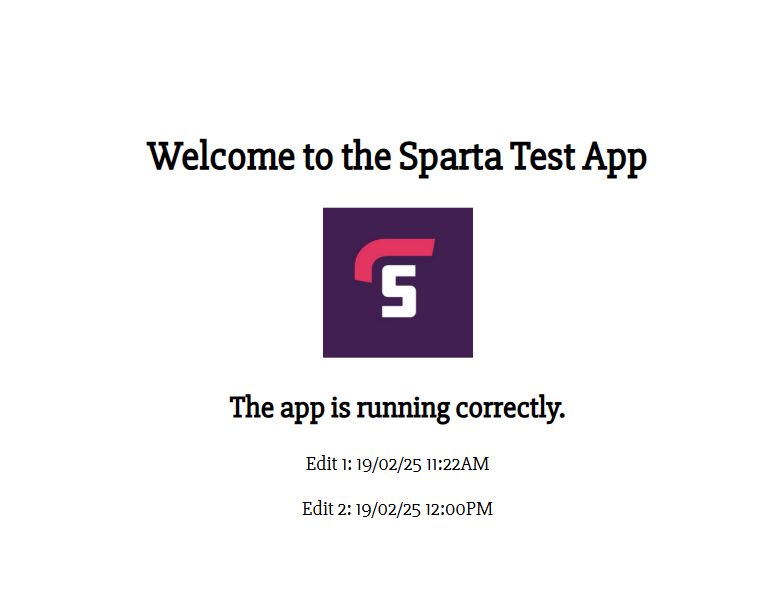
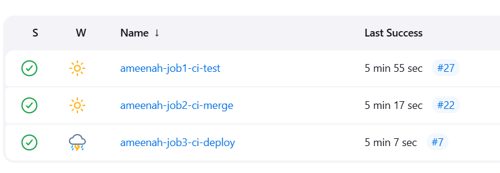

